# PR Code Auditor AI - Multi-Agent Architecture with Google ADK, FastMCP, A2UI, and A2A

Automated end-to-end Pull Request security, quality, and architecture auditing system. This platform leverages a multi-agent pipeline built with **Google Agent Development Kit (ADK)**, an **MCP (Model Context Protocol)** server built with **FastMCP**, an interactive frontend rendering **A2UI Protocol v0.9** surfaces, and inter-agent communication exposed via **A2A (Agent-to-Agent) Protocol**.

---

## 1. Project Overview

The PR Code Auditor AI platform automates code reviews for public and private GitHub repositories. When a repository is submitted, an autonomous multi-agent pipeline analyzes open pull requests, inspects changed files, checks for security vulnerabilities (OWASP Top 10), evaluates SOLID design principles, and generates a structured technical report.

### Key Capabilities
* **Automated GitHub Inspection**: Fetches open pull requests and retrieves source files using a dedicated FastMCP GitHub server over Streamable HTTP.
* **Iterative Refinement Loop (LoopAgent Pattern)**: Combines a primary investigator agent with an independent critic agent that reviews findings, checks for omissions, and provides feedback until quality gates are satisfied.
* **Structured Data Synthesis**: Emits type-safe Pydantic reports (`PRCodeAuditReport`) with quality scoring, verdict assignment, and prioritized issue lists.
* **Dual Interface**: Offers both a pipeline visualization dashboard with live SSE streaming console logs and an interactive conversational chat powered by the A2UI protocol (`a2ui-agent-sdk`).
* **Inter-Agent Protocol Support**: Exposes A2A Agent Cards at `/.well-known/agent.json` for seamless integration into larger agent networks.
* **Enterprise Cloud Deployment**: Fully containerized and deployable to Google Cloud Run using Vertex AI for model inference.

---

## 2. Architecture & Component Interaction

```mermaid
sequenceDiagram
    autonumber
    actor User as Engineer / Auditor
    participant FE as Frontend (Vanilla JS + A2UI)
    participant ADK as ADK Agent Backend (FastAPI :8000)
    participant MCP as FastMCP GitHub Server (:8085)
    participant GH as GitHub API
    participant VAI as Vertex AI (Gemini 2.5)

    User->>FE: Enter repository (e.g. octocat/Hello-World)
    FE->>ADK: POST /run_sse (repo_path)
    
    rect rgb(30, 41, 59)
        note over ADK, MCP: ADK Multi-Agent Loop Execution
        ADK->>VAI: Prompt pr_investigator_agent (gemini-2.5-flash-lite)
        VAI->>ADK: Tool call: list_open_pull_requests(owner, repo)
        ADK->>MCP: HTTP POST /mcp (list_open_pull_requests)
        MCP->>GH: GET /repos/{owner}/{repo}/pulls
        GH-->>MCP: Return Open Pull Requests JSON
        MCP-->>ADK: Tool Result (PR List)
        
        ADK->>VAI: Tool call: get_file_content(owner, repo, path)
        ADK->>MCP: HTTP POST /mcp (get_file_content)
        MCP->>GH: GET /repos/{owner}/{repo}/contents/{path}
        GH-->>MCP: Return File Source Code
        MCP-->>ADK: Tool Result (Source Code)
        
        ADK->>VAI: Prompt critical_reviewer_agent (gemini-2.5-flash)
        VAI-->>ADK: Review Feedback / Call approve_audit()
        ADK->>VAI: Prompt pr_report_agent
        VAI-->>ADK: Structured Pydantic PRCodeAuditReport JSON
    end

    ADK-->>FE: Stream SSE Events & A2UI Surface Payload
    FE->>User: Render Live Pipeline, Interactive A2UI Chat & PDF Export
```



### Component Reference Table

| Component | Port | Technology Stack | Primary Purpose |
| :--- | :--- | :--- | :--- |
| **`mcp-server-github`** | 8085 | FastMCP, Python 3.12, `uv`, HTTP Streamable | Exposes GitHub tools (`list_open_pull_requests`, `get_file_content`) via MCP protocol. |
| **`pr-auditor-agent`** | 8000 | Google ADK 2.5.0, FastAPI, Pydantic, Vertex AI | Orchestrates multi-agent pipeline (`LoopAgent`, `SequentialAgent`) and serves SSE/A2A endpoints. |
| **`pr-auditor-frontend`** | 3000 | HTML5, Tailwind CSS, Vanilla JS, `html2pdf.js` | Provides pipeline dashboard, A2UI chat interface, and PDF export capabilities. |
| **`infrastructure`** | Cloud Run | Docker, Cloud Build, GCP Secret Manager | Manages containerization, IAM permissions, GCP API setup, and Cloud Run deployments. |

---

## 3. GCP Setup & Gemini Authentication Guide

This application consumes Google Gemini models (`gemini-2.5-flash-lite` and `gemini-2.5-flash`) hosted on **Google Cloud Vertex AI**. An active Google Cloud Platform (GCP) project with Vertex AI APIs enabled is required.

### Required Authentication Commands

Run the following commands in your terminal to authenticate your local environment with GCP Application Default Credentials (ADC):

```bash
# 1. Authenticate user account with Google Cloud CLI
gcloud auth login

# 2. Authenticate Application Default Credentials (ADC) for Python SDKs
gcloud auth application-default login

# 3. Set target GCP Project context
gcloud config set project <YOUR_GCP_PROJECT_ID>

# 4. Set Application Default Credentials quota project
gcloud auth application-default set-quota-project <YOUR_GCP_PROJECT_ID>

# 5. Enable necessary Google Cloud Platform APIs
gcloud services enable \
  aiplatform.googleapis.com \
  run.googleapis.com \
  cloudbuild.googleapis.com \
  secretmanager.googleapis.com \
  artifactregistry.googleapis.com
```

### Environment Variable Setup
In `pr-auditor-agent/.env`, ensure Vertex AI mode is enabled:
```env
GOOGLE_GENAI_USE_VERTEXAI=true
GOOGLE_CLOUD_PROJECT=<YOUR_GCP_PROJECT_ID>
GCP_REGION=us-central1
GEMINI_MODEL=gemini-2.5-flash-lite
CRITIC_MODEL_NAME=gemini-2.5-flash
```

---

## 4. Agent Skills & MCP Harness Setup

To maximize development efficiency, token savings, and architectural compliance during workshops, developers should prepare their environment using the **Expert AI Developer Skills** framework (`skills.sh`).

### Setting Up the Skills Harness
Install or reference agent skills from the repository: [jggomez/expert-ai-developer-skills](https://github.com/jggomez/expert-ai-developer-skills).

```bash
# Clone the skills repository or install via skills manager
git clone https://github.com/jggomez/expert-ai-developer-skills.git ~/.agents/skills
```

### Installed Agent Skills Catalog

The project includes specialized filesystem-based skills in `.agents/skills/`. We strongly recommend invoking these skills when developing or modifying components:

* **`ag-ui-a2ui-integration`**: Guides scaffolding and integration of A2UI surface rendering with AG-UI supported frameworks.
* **`google-agents-cli-adk-code`**: Provides ADK Python API patterns, sub-agent types, toolset definitions, callbacks, and state management rules.
* **`google-agents-cli-scaffold`**: Standardizes agent project directory layout and lifecycle management (`create`, `enhance`, `upgrade`).
* **`google-agents-cli-deploy`**: Provides deployment patterns for Google Agent Runtime, Cloud Run, and GKE.
* **`google-agents-cli-eval`**: Outlines quality evaluation datasets, LLM-as-judge scoring, and rubric creation.
* **`cloud-run-basics`**: Manages Cloud Run services, background jobs, and worker pools.
* **`python-expert`**: Enforces PEP 8 compliance, static type hinting (`mypy`), generator optimization, and async concurrency.
* **`test-driven-development`**: Guides Red-Green-Refactor testing cycles and mock isolation.
* **`commit-expert`**: Validates Conventional Commit standards and local git hook setups.
* **`detect-code-smells`**: Diagnoses architectural design flaws, SOLID violations, and technical debt.
* **`documentation-expert`**: Establishes technical documentation standards and diagram creation templates.
* **`web-design-guidelines`**: Enforces modern UI/UX design, accessibility, and clean CSS layout standards.
* **`karpathy-guidelines`**: Behavioral constraints preventing over-engineering and enforcing surgical code edits.

### Available Model Context Protocol (MCP) Servers

Antigravity CLI and ADK agents utilize Model Context Protocol (MCP) servers to execute system operations deterministically:

* **`adk-docs-mcp`**: Search and retrieve official Google ADK documentation and API references.
* **`bigquery`**: Execute read-only SQL queries and explore schema definitions.
* **`chrome-devtools`**: Run browser interactions, client-side audits, and DOM inspection.
* **`cloudrun`**: Inspect deployed Cloud Run services, configuration states, and container execution logs.
* **`firebase-mcp-server`**: Execute Firestore database operations, security rules validation, and remote config updates.

### Workspace Enforcement Rules (`.agents/rules/`)

Developers and AI subagents must strictly adhere to the project rules located in `.agents/rules/`:

1. **`clean-code-and-principles.md`**: Enforces SOLID principles (SRP, OCP, LSP, ISP, DIP), DRY, KISS, and a zero-tolerance policy for God classes and duplicated logic.
2. **`context-and-token-optimization.md`**: Mandates surgical file line range reads, context window conservation, and local execution scripts.
3. **`secure-coding-and-secrets.md`**: Prevents credentials leakage into version control, enforces OWASP Top 10 standards, and mandates input validation.
4. **`skills-and-mcp-awareness.md`**: Requires checking local skills and MCP tools before generating custom ad-hoc code.
5. **`tdd.md`**: Mandates Test-Driven Development (TDD) workflow.
6. **`testing-after-changes.md`**: Requires automated test suite execution after every code modification.

---

## 5. Local Development & Testing Guide

### Running Services Locally

#### 1. Start the FastMCP GitHub Server (Port 8085)
```bash
cd mcp-server-github
uv sync
uv run mcp-server-github --transport streamable-http --host 0.0.0.0 --port 8085
```

#### 2. Start the ADK Agent Backend (Port 8000)
```bash
cd pr-auditor-agent
uv sync
uv run uvicorn app.fast_api_app:app --host 0.0.0.0 --port 8000
```

#### 3. Start the Web Frontend (Port 3000)
```bash
cd pr-auditor-frontend
python3 -m http.server 3000
```

Access the application in your browser at `http://localhost:3000`.

#### Automated All-in-One Launcher
Alternatively, start all three services simultaneously using the root launcher script:
```bash
./start.sh
```

### Executing Automated Test Suites

#### FastMCP Server Unit & Integration Tests
```bash
cd mcp-server-github
uv run pytest
```

#### ADK Agent Suite & Evaluation Tests
```bash
cd pr-auditor-agent
uv run pytest
```

---

## 6. Workshop Step-by-Step Guide: Building from Scratch with Antigravity CLI

This section provides a step-by-step tutorial for building this platform from scratch. Workshop attendees use **Antigravity CLI (`agy`)**, an agentic coding assistant, to generate each component sequentially using targeted prompts.

---

### Step 1: Create the FastMCP GitHub Server

#### Objective
Build an independent Model Context Protocol (MCP) server in Python using **FastMCP** and `uv` for dependency management. The server exposes GitHub integration tools over a Streamable HTTP transport on port 8085.

#### Architecture Details
* File Structure:
  * `pyproject.toml` using `hatchling` or `uv_build`.
  * `.env` for `GITHUB_PERSONAL_ACCESS_TOKEN` and `PORT=8085`.
  * `src/mcp_server_github/server.py`: FastMCP instance definition.
  * `src/mcp_server_github/github_client.py`: PyGithub wrapper.
  * `tests/`: Pytest unit and integration test suite.
* Exposed Tools:
  1. `list_open_pull_requests`: Lists open PRs for a repository.
  2. `get_file_content`: Fetches file contents (source files, Dockerfiles, YAML workflows).

#### Antigravity CLI Prompt
```text
Create a directory called mcp-server-github, an MCP server in Python using FastMCP. For dependency management, use uv. Create a .env file for environment variables. The server should connect to GitHub and include these two tools:
1. List open Pull Requests of a repository for review
2. Obtains the content of a specific file from a public/private GitHub repository. Use this to inspect source code, Dockerfiles, or workflow YAMLs

Additionally, create unit tests and integration tests testing all the tools. Also, create a main method that exposes the server via streamable HTTP, set the port using an environment variable, and assign 8085 for the MCP server.
```

#### Verification Command
```bash
cd mcp-server-github && uv run pytest
```

---

### Step 2: Create the Primary Investigation Agent (Google ADK)

#### Objective
Build an Agent application using **Google Agent Development Kit (ADK)**. Create `pr_investigator_agent` which connects to the FastMCP server over HTTP using `McpToolset`, analyzes repository files, detects security flaws and code smells, and outputs a structured Pydantic report (`PRCodeAuditReport`). Expose the agent via an SSE (Server-Sent Events) streaming FastAPI server.

#### Architecture Details
* Pydantic Output Schema (`PRCodeAuditReport`):
  * `repository`: string
  * `audit_summary`: string
  * `overall_quality_score`: integer (0-100)
  * `issues`: list of `CodeIssue` objects (file_path, line_number, severity, summary, recommendation)
  * `solid_compliance_notes`: string
  * `security_assessment`: string
  * `conclusion`: string
* Model: `gemini-2.5-flash-lite` via Vertex AI / Google GenAI SDK.
* Evaluation Suite: `evals/eval_investigator.py` executing at least 5 test scenarios.

#### Antigravity CLI Prompt
```text
Create an agent application using ADK (Agent Development Kit) with best practices. Create an agent that reviews pull requests from a repository provided by the user, reviews all files, and performs a code audit, detecting code smells, bad coding practices, vulnerabilities, and everything related, and finally provides a technical report. This agent must use the tools of the MCP server created using the streamable-http protocol and the toolset class provided by ADK. Apply best practices for agent instructions in English, including role, responsibility, objective, guardrails, and tool descriptions. The agent must provide a structured output. Use the Gemini 2.5 Flash Lite model, with best practices for retries. Additionally, create evaluations to verify its correct operation; perform at least 5 evaluations. Expose this agent via streaming with the ADK libraries to be called by a frontend. Use uv for the dependency management.
```

#### Verification Command
```bash
cd pr-auditor-agent && uv run pytest tests/unit/test_investigator_agent.py
```

---

### Step 3: Implement the LoopAgent Pattern with a Critical Reviewer

#### Objective
Enhance the ADK multi-agent architecture by introducing `critical_reviewer_agent` using the `LoopAgent` pattern. The critic agent uses `gemini-2.5-flash` to inspect the investigator's initial findings, verify missing security issues or uninspected files, and provide feedback. Once satisfied, the critic calls `approve_audit()` to terminate the loop and hand off to `pr_report_agent` for final Pydantic serialization.

#### Architecture Details
* Agents:
  1. `pr_investigator_agent`: Initial analysis.
  2. `critical_reviewer_agent`: Critic agent wrapped in a `LoopAgent(max_iterations=3)`.
  3. `pr_report_agent`: Report synthesizer.
* Combined Pipeline: `SequentialAgent(name="pr_auditor_pipeline", sub_agents=[pr_investigator_agent, refinement_loop, pr_report_agent])`.
* Quality Rubrics: Added custom evaluation rubrics in `evals/` checking OWASP completeness and false-positive reduction.

#### Antigravity CLI Prompt
```text
Add a new critical agent that uses the Gemini-2.5-flash model to analyze the report, also view the repository, and evaluate if it has been fully detected and if the findings found by the research agent are correct or if findings are missing, and pass these as feedback to the research agent. This is a critical reviewer using the loop pattern. At the end, the report is generated. Increase the quality of the evaluations, and add other rubrics to validate this.
```

#### Verification Command
```bash
cd pr-auditor-agent && uv run pytest tests/unit/test_loop_agent.py
```

---

### Step 4: Build the Web Frontend Application

#### Objective
Develop a single-page frontend application using HTML5, Tailwind CSS, and Vanilla JavaScript adhering to Clean Architecture principles (Domain, Use Cases, Infrastructure, Presentation). The UI must visualize real-time agent pipeline execution, stream logs via SSE, display the structured technical report, and export clean PDF documents.

#### Architecture Details
* UI Sections:
  * Hero banner with quick-fill repository buttons (`octocat/Hello-World`, `google/adk-python`).
  * Live Agent Execution Pipeline (Progress bar + Status cards for Investigator, Critic, and Report Generator).
  * Streaming Console Feed with log filtering and clear actions.
  * Technical Report Container with quality score badge, executive summary, OWASP assessment, SOLID breakdown, and severity filters (Critical, High, Medium, Low).
  * PDF Exporter using `html2pdf.js` with print-optimized CSS overrides.

#### Antigravity CLI Prompt
```text
Create a frontend application using HTML, Tailwind, and Vanilla JS. This application must allow the user to enter a URL of the repository they want to evaluate its pull requests. The frontend must show the available agents and show the user in real-time which step it is in, giving information all the time. At the end, it must give the user the organized report with the option to export to PDF. Analyze and implement UX/UI best practices.
```

#### Verification Command
```bash
cd pr-auditor-frontend && python3 -m http.server 3000
```

---

### Step 5: Integrate Conversational Chat with A2UI Protocol

#### Objective
Add a conversational chat tab to the frontend powered by the **A2UI Protocol v0.9** using the `a2ui-agent-sdk` Python package. The agent emits structured A2UI JSON surface definitions over the SSE stream, which the client-side JavaScript engine parses and renders into dynamic, interactive UI widgets (cards, score badges, action buttons).

#### Architecture Details
* Backend Integration: `a2ui-agent-sdk` wrapper generating `A2UI Component Trees`.
* Frontend Renderer: `A2uiParser.js` and `A2uiRenderer.js` converting A2UI JSON payloads into native DOM nodes inside the chat message feed.

#### Antigravity CLI Prompt
```text
Also, create a chat option in the frontend, where it starts by asking the user for the repository and then the agents must use the A2UI protocol, using this a2ui-agent-sdk library with Python. Review the necessary skills for this.
```

---

### Step 6: Expose Agents via A2A (Agent-to-Agent) Protocol

#### Objective
Expose the ADK agents using the open **A2A (Agent-to-Agent)** specification. Provide Agent Card JSON endpoints at `/.well-known/agent.json` and sub-agent paths (`/agents/investigator/.well-known/agent.json`, `/agents/critic/.well-known/agent.json`), allowing external autonomous agents to discover capabilities, authentication schemes, and invocation interfaces.

#### Architecture Details
* Endpoints:
  * `GET /.well-known/agent.json`: Root Agent Card describing `pr_auditor_pipeline`.
  * `GET /agents/investigator/.well-known/agent.json`: Sub-agent card for investigator.
  * `GET /agents/critic/.well-known/agent.json`: Sub-agent card for reviewer.
  * `POST /a2a/v1/tasks`: A2A task creation endpoint.
* Environment Variables: `A2A_AGENT_CARD_URL`, `A2A_INVESTIGATOR_CARD_URL`, `A2A_CRITIC_CARD_URL`.

#### Antigravity CLI Prompt
```text
We are going to use the A2A protocol between agents. Expose the agents with this protocol. If you need to, review this info: https://adk.dev/a2a/intro/. Also, you can put all agent URLs and card URLs in the .env file.
```

#### Verification Command
```bash
curl -s http://localhost:8000/.well-known/agent.json
```

---

### Step 7: Infrastructure Suite & Google Cloud Run Deployment

#### Objective
Create an `infrastructure/` directory containing production-ready Dockerfiles, Cloud Build configurations, and an automated deployment shell script (`deploy.sh`) for Google Cloud Run. The script enables required GCP APIs, provisions Artifact Registry repositories, configures Service Account IAM permissions, sets up GCP Secret Manager credentials, and deploys all 3 services using Vertex AI for Gemini inference.

#### Directory Layout
```text
infrastructure/
├── mcp-server/
│   ├── Dockerfile
│   └── cloudbuild.yaml
├── agent-server/
│   ├── Dockerfile
│   └── cloudbuild.yaml
├── frontend/
│   ├── Dockerfile
│   ├── nginx.conf.template
│   ├── docker-entrypoint.sh
│   └── cloudbuild.yaml
├── deploy.sh
└── README.md
```

#### Deployment Workflow
1. Multi-Stage Dockerfiles:
   * Stage 1 (`builder`): Installs dependencies with `uv sync --frozen --no-dev` after copying source trees (`src/`, `app/`).
   * Stage 2 (`runtime`): Uses lightweight distroless or alpine base images.
2. Deployment Script (`deploy.sh`):
   * Prompts for or reads `--project <GCP_PROJECT_ID>`.
   * Enables APIs: `run`, `cloudbuild`, `artifactregistry`, `iam`, `secretmanager`, `aiplatform`.
   * Creates Service Account `pr-auditor-sa` with `roles/aiplatform.user`, `roles/logging.logWriter`, and `roles/secretmanager.secretAccessor`.
   * Binds secrets `gemini-api-key` and `github-token` in Secret Manager.
   * Deploys `mcp-server-github`, `pr-auditor-agent` (configured with `GOOGLE_GENAI_USE_VERTEXAI=true`), and `pr-auditor-frontend` (injecting `AGENT_SERVER_URL` into Nginx at startup).

#### Antigravity CLI Prompt
```text
Create an infrastructure directory where you put the necessary scripts to deploy to Cloud Run. The MCP server, agent server, and frontend are each a respective service. Create an optimized Docker, Cloud Build YAML, and a shell script for each one that deploys all three, enables the necessary services in GCP, sets the necessary credentials, and asks for the GCP Project ID upon startup. Ensure Gemini models are used with Vertex AI. Execute the shell script after the build finishes, verify each service in GCP, and ensure the app runs in production.
```

#### Production Deployment Command
```bash
./deploy.sh --project <YOUR_GCP_PROJECT_ID>
```

---

## 7. Verification & Production Audit Checklist

Before declaring a deployment complete, verify all quality gates:

- [x] FastMCP Server unit & integration tests pass (`uv run pytest` inside `mcp-server-github/`).
- [x] ADK Agent backend unit & A2A endpoint tests pass (`uv run pytest` inside `pr-auditor-agent/`).
- [x] FastMCP Server exposes HTTP endpoint at `/mcp` on port 8085.
- [x] ADK Agent Server exposes `/run_sse` and `/.well-known/agent.json` on port 8000.
- [x] Frontend application correctly switches between SSE streaming backend mode and offline Demo mode.
- [x] All 3 Cloud Run services (`mcp-server-github`, `pr-auditor-agent`, `pr-auditor-frontend`) report `STATUS: SUCCESS` on GCP Cloud Run.
- [x] Vertex AI integration verified with ADC (`roles/aiplatform.user`).
